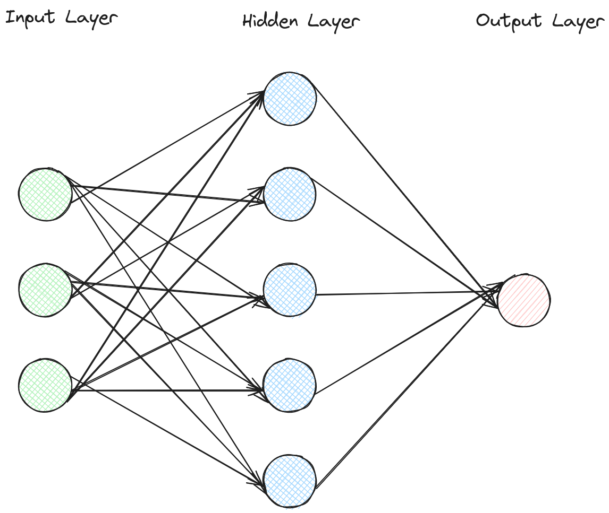

= Documentation 
TechFoxxo <techfoxxo at protonmail dot com>
2023-11-23
:stem:
:toc:

== Project Components
=== API 
Prg. Languages: `kotlin` +
Folder: `ai-stuffs` +
Developer: `Maikel` +
Base URL: `http://<service>:8080/v1`

.Generate Learningdata
[sidebar, options=unbreakable]
--
URI: `/gen` +
*Result:* +
Kotlin Dataclass: `TrainResponse` +
Type: `Object` +
Structure:
[cols="4*^,6"]
|===
| Name | Datatype | Kotlin Datatype | null possible | Description
| `code` | `Int` | `Int` | N | The exit code of the golang process
| `message` | `String` | `String` | N | The `stdout` or `stderr` of the golang process
|===

.Response Example
[source, json]
----
{
    "code": 0,
    "message": "Process successfully finished."
}
----
--

.Train Model
[sidebar, options=unbreakable]
--
URI: `/train` +
*Result:* +
Kotlin Dataclass: `TrainResponse` +

Type: `Object` +
Structure:
[cols="4*^,6"]
|===
| Name | Datatype | Kotlin Datatype | null possible | Description
| `code` | `Int` | `Int` | N | The exit code of the python process
| `message` | `String` | `String` | N | The `stdout` or `stderr` of the python process
|===

.Response Example
[source, json]
----
{
    "code": 0,
    "message": "Here could be your ad!"
}
----
--

.Generate Boiler Temperature
[sidebar, options=unbreakable]
--
URI: `/calc` +
Possible arguments:
[cols="2*^,6"]
|===
| Type | Name | Description
| Query | `inside` | Current indoor temperature
| Query | `outside` | Current outdoor temperature
| Query | `target` | The indoor temperature that should be
|===

*Result:* +
Kotlin Dataclass: `DiffResult` +
Type: `Object` +
Structure:
[cols="4*^,6"]
|===
| Name | Datatype | Kotlin Datatype | null possible | Description
| `target` | `Double` | `Double?` | Y | Value provided by Query Param `target`
| `inside` | `Double` | `Double?` | Y | Value provided by Query Param `inside`
| `outside` | `Double` | `Double?` | Y | Value provided by Query Param `outside`
| `boiler` | `Double` | `Double?` | Y | The temperature the boiler should be set to
| `error` | `String` | `String?` | Y | Error message. Will be null if there was no error
|===

.Response Example
[source, json]
----
{
    "target": 21.0,
    "inside": 17.0,
    "outside": 6.0,
    "boiler": 71.0,
    "error": null
}
----
--

<<<

=== AI Learningdata Generation
Prg. Languages: `golang` +
Folder: `datagen` + 
Developer: `Maikel` +
Usage: `./ai-datagen`

Formula for boiler temperature: +
`Boiler = (BoilerBase\((Inside-Outside)*BoilerMul) + ((Target-Inside)*OutsideMul))`

Generates the amount of entries defined in variable `SAMPLE_DATA_SIZE`. The generated data will be exported into a CSV
File with the following structure:
.CSV Structure, semicolon seperated
|====
| *target* | *inside* | *outside* | *boiler*
| 21.0000 | 20.0000 | 23.9000 | 28.7000
| 21.0000 | 21.0000 | 12.1000 | 52.8000
| 21.0000 | 21.0000 | 13.5000 | 50.0000
| ... | ... | ... | ...
|====

=== AI
Prg. Languages: `python` +
Folder: `knn_heizung` +
Developer: `Steven`

==== Training & Architecture
The Artificial Neural Network has the following structure:

The Artificial Neural Network has three neurons as input layer - one for each
feature (target-, inside- and outside-temperature). 

There is a hidden layer with five neurons for further processing. The hidden
layer is neccessary because the AI needs to be able to pick up a certain
threshold of complexity from the dataset.

Since only one label is expected, there is only one neuron in the output layer.

Since this ANN is supposed to solve a regression problem as opposed to a 
(multi-)classification problem, the mean squeare error is used as the loss
function, and the absolute error is used as the metric for the model.

The Mean Square Error function is supplied by the keras package and works by
using the difference between the models predictions and the ground truth, which
is then squared and averaged out across the whole dataset.

==== Training and Running

Training and running is logically seperate for operation reasons. The model is
trained using the generated training data from  the `datagen` program, with 100
rows at a time and 50 iterations over the whole dataset, after which the model
is then exported.

For running the AI, the trained model is loaded and fed with the three input
values. After about 3 seconds, a single float value, the predicted label, should
be returned.

=== WebUI
Prg. Languages: `html,js,css` +
Folder: `webui` +
Developer: `Constantin`
